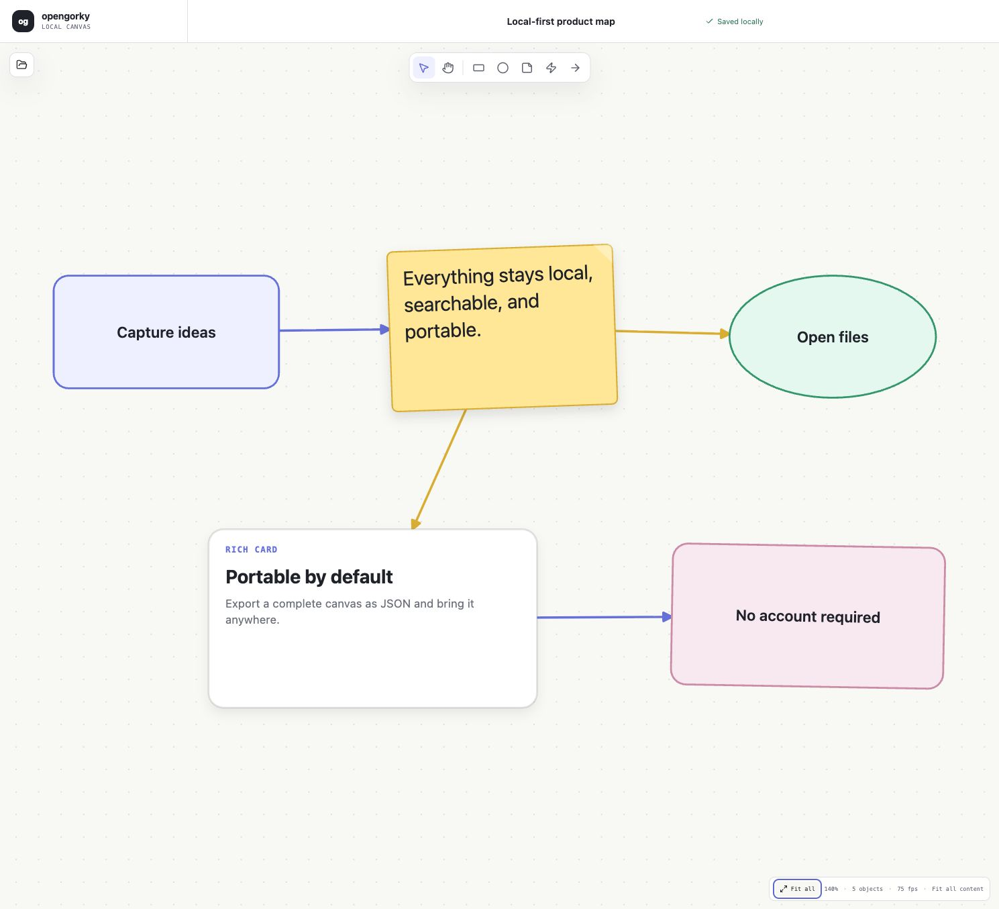

# opengorky

[](https://github.com/nostrapollo/opengorky/actions/workflows/ci.yml)
[](LICENSE)

A free and open-source, local-first interactive canvas workspace.

**[Try opengorky in your browser](https://nostrapollo.github.io/opengorky/)** —
no account or backend required.



> **Early preview:** opengorky is an actively evolving proof of concept. Its
> document format may change before the first stable release.

The repository now includes a local-first proof of concept for validating the
proposed editor stack and architecture.

## Product thesis

Build a spatial workspace for creating and navigating rich visual files:

- fast, expressive infinite canvas
- rich objects, embeds, diagrams, and structured content
- durable local files with an open and portable format
- excellent browsing, search, and navigation across saved files
- useful without an account or server
- extensible without locking core functionality behind a hosted service

## Current work

- [Feature and market research](docs/research/feature-landscape.md)
- [Proposed MVP scope](docs/research/mvp-scope.md)
- [Technology stack research](docs/research/tech-stack.md)
- [Proposed architecture](docs/architecture/overview.md)

## Run the proof of concept

Requires Node.js 22.13 or newer.

```bash
npm ci
npm run dev
```

Open `http://localhost:3000`. The POC currently demonstrates:

- an infinite Konva canvas with middle-drag panning, zoom, selection, resize, rotate, and connectors
- drag-to-size shape creation in any direction, with live bounds preview
- a click-to-type text tool with font sizing, alignment, movement, and export support
- a process-diagram palette with process, decision, start/end, data, document, database, subprocess, and manual-operation symbols
- editable canvas-native shapes, sticky notes, links, images, and service nodes
- clipboard image paste with native canvas selection, resize, rotation, and persistence
- a searchable Google Cloud architecture pack with draggable, connectable service nodes
- a searchable local file library with create, duplicate, delete, and navigation
- autosave to origin-private files (OPFS), with IndexedDB fallback
- portable JSON import and export
- self-contained HTML export with SVG rendering, clickable links, and fit/pan/zoom controls

No account or backend is required. Browser data is scoped to the site's origin,
so exported JSON is the portable backup and interchange format.
The hosted build is the same static frontend as the local app; it has no
application backend. Read the [privacy summary](app/privacy/page.tsx).

## Verify

```bash
npm run typecheck
npm test
npm run build
```

## Dependency transparency

- [CycloneDX software bill of materials](docs/sbom.cdx.json)
- [Third-party dependency license inventory](docs/third-party-licenses.md)
- [Google Cloud architecture pack and artwork provenance](docs/architecture/gcp-pack.md)

## Contributing

Contributions and focused bug reports are welcome. Read
[CONTRIBUTING.md](CONTRIBUTING.md) before opening a pull request and use the
repository issue forms for reproducible bugs or scoped feature proposals.

Security issues should not be filed publicly. Follow [SECURITY.md](SECURITY.md)
for private reporting instructions.

## Publication status

The source repository is public and the static app is published with GitHub
Pages. The remaining owner decisions are tracked in
[docs/publishing.md](docs/publishing.md), including the canonical domain.

## Status

POC. Multiplayer is explicitly out of scope. The architecture and stack remain
subject to validation; the implementation is deliberately narrow and is not yet
a production editor. opengorky is available under the [MIT License](LICENSE).
