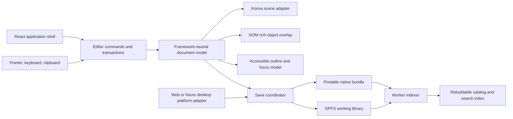

# Proposed architecture

Status: proposed for validation

Date: 2026-08-02
Revised: 2026-08-26

## Architectural thesis

The native file and document model are the product core. Rendering, storage,
search, packaging, and future desktop integration are replaceable adapters.

The app is local-first and single-user. It has no backend in the core topology.
An authenticated server may be added as an optional persistence adapter without
becoming a dependency of the editor; see the
[server persistence plan](server-persistence.md).



## Dependency rule

Dependencies point inward:

```text
React UI / Konva / Lexical / OPFS / Tauri or Electron
                         ↓
                application services
                         ↓
              document, commands, files
```

The inner packages do not import React, Konva, browser storage APIs, Tauri,
Electron, or a search library. This rule protects the native format and makes
renderer/persistence spikes honest comparisons.

## Proposed package boundaries

```text
apps/
└── web/                    PWA shell and composition root

packages/
├── document-model/         objects, geometry, hierarchy, styles, content
├── editor-core/            tools, selection, transactions, history, clipboard
├── renderer-konva/         scene projection, hit testing, viewport, guides
├── rich-overlays/          Lexical, embeds, media, accessibility bridge
├── native-format/          manifest, bundle, validation, migrations, assets
├── persistence/            ports plus OPFS/IndexedDB implementations
├── catalog-search/         metadata extraction and worker index
├── import-export/          SVG, PNG, PDF, JSON Canvas, Excalidraw
├── platform/               browser adapter and future desktop contract
└── ui/                     reusable shell components and design tokens
```

A pnpm workspace is reasonable from the start because the boundaries are
meaningful runtime/test seams, not a microservice plan. Avoid Turborepo until
workspace task execution actually becomes slow or complex.

## Core domain model

The document is normalized rather than a renderer tree:

```ts
type Document = {
  schemaVersion: number
  id: string
  metadata: DocumentMetadata
  objects: Record<ObjectId, CanvasObject>
  rootIds: ObjectId[]
  components: Record<ComponentId, ComponentDefinition>
  assets: Record<AssetId, AssetDescriptor>
}
```

Every object has:

- stable ID and type discriminator
- parent/frame relationship
- document-space geometry and transform
- style and content payload
- ordered child IDs when it is a container
- optional component-instance relationship
- optional accessibility name/description
- extension data that survives unknown-type round trips

Renderer caches, selection, hover, open panels, active text-edit sessions,
viewport and search results are session state and never saved as
document truth.

## Commands, transactions, and history

All persistent edits flow through document operations grouped into transactions.

Examples:

- `CreateObjects`
- `MoveObjects`
- `ResizeObjects`
- `SetObjectProperties`
- `ReparentObjects`
- `CreateConnectorBinding`
- `EditRichText`

A transaction contains a label, ordered operations, inverse operations or a
reversible patch, timestamp, and affected IDs. Pointer movement may preview
ephemeral transforms at frame rate; pointer-up commits one transaction.

This provides:

- meaningful undo steps
- one save notification per user action
- deterministic tests
- a future automation API that uses the same semantics as the UI
- snapshot boundaries without storing every pointer event

Do not implement event sourcing as the canonical file. The current document is
the saved truth; the bounded history/journal is recovery metadata.

## Renderer boundary

`RendererAdapter` responsibilities:

- project visible document objects into scene nodes
- maintain viewport culling and level-of-detail rules
- update only changed objects
- perform hit testing and rectangle/polygon selection
- render editor-only affordances such as guides and handles
- supply geometry/text measurements through explicit services
- produce raster previews where appropriate

It emits semantic hit results and input intents. It does not own document IDs,
serialization or history state.

World transforms use a shared matrix implementation. Konva nodes and DOM
overlays receive matrices derived from the same source to prevent drift.

## Rich overlay lifecycle

DOM objects have three modes:

1. **Proxy** — lightweight scene representation for distant/offscreen content.
2. **Visible** — DOM presentation mounted inside the viewport.
3. **Editing** — full editor controls mounted; canvas shortcuts are scoped or
   suspended appropriately.

Only visible or active overlays mount. A spatial index determines visibility.
When a live object unmounts, it leaves a scene snapshot or placeholder. This
prevents hundreds of iframes/editors from overwhelming layout and memory.

## Persistence architecture

`DocumentRepository` is a port with implementations for:

- OPFS working library
- imported/exported native bundle
- user-selected directory where supported
- future desktop filesystem
- in-memory tests
- optional authenticated remote persistence, coordinated only after a local
  save completes

The save coordinator follows:

1. freeze a consistent document revision
2. validate internal invariants
3. collect referenced assets
4. serialize deterministically in a worker
5. write a new candidate bundle/journal entry
6. reopen and validate the candidate
7. replace the previous working copy
8. update catalog metadata and thumbnail
9. mark the revision saved

If a newer revision exists after step 4, the coordinator schedules another save
rather than declaring the editor clean.

The catalog stores projections only. On startup it reconciles manifests/content
hashes and incrementally repairs itself. A user can request a full rebuild.

## Worker topology

Keep the UI thread dedicated to input, viewport updates, small document
transactions, and DOM reconciliation.

Use workers for:

- bundle compression/decompression
- schema validation and migrations
- search extraction/indexing
- thumbnails and heavy export where platform support allows
- asset hashing
- large-file parsing

Worker messages are versioned typed envelopes. Transfer `ArrayBuffer` objects
instead of cloning asset bytes.

## Security boundaries

Threats exist even without a server because documents and embeds may be
untrusted.

Requirements:

- parse native files as data; never evaluate document content
- reject archive path traversal and decompression bombs
- cap total uncompressed size, asset count, dimensions, and parse depth
- validate MIME by content where practical, not filename alone
- render rich text without unsanitized HTML
- sandbox embeds with the smallest required iframe permissions
- never combine broad iframe capabilities for convenience
- block top-level navigation and unapproved external protocol handlers
- keep a restrictive Content Security Policy
- treat preview generation and PDF/image parsing as hostile-input paths
- future desktop adapters expose narrow commands, not raw filesystem or shell
  access to the renderer
- future plugins require declared permissions, isolation, and a kill switch

Remote embeds never receive filesystem/platform capabilities. Offline fallback
content must remain usable when an embed is blocked or unavailable.

## Performance architecture

Plan for performance structurally:

- spatial index for culling, hit testing, and minimap queries
- dirty-object projection rather than full-scene rebuilds
- dedicated scene layers for static content, active selection, guides, and
  transient drawing
- cached complex paths/images at appropriate zoom levels
- DOM overlay virtualization
- lazy asset decode and thumbnail loading
- transaction coalescing for drag/resize
- worker-based indexing, serialization, hashing, and packaging
- memory budget and eviction policy for decoded media

Do not adopt WebGL/WebGPU preemptively. Measure the Konva/Canvas2D implementation
against the documented budgets, then replace only the renderer adapter if
necessary.

## Accessibility architecture

The accessible experience is not derived solely from pixels:

- file browser and application controls are semantic DOM
- active rich objects use native DOM semantics
- a synchronized document outline exposes frames and objects as a navigable tree
- objects have persisted accessible names and optional descriptions
- keyboard users can move focus from the outline to an object and edit it
- editor operations are available through commands and property panels, not
  pointer gestures alone
- document reading order is explicit per frame

Automated accessibility checks are necessary but insufficient; keyboard and
screen-reader acceptance scripts belong in the release checklist.

## Testing strategy

### Unit and property tests

- geometry, transforms, snapping, connector binding, and spatial index
- every command and inverse/history behavior
- deterministic serialization
- migrations from every supported schema version
- unknown-object round trips
- malformed and adversarial bundle handling

### Integration tests

- document operations projected correctly into renderer adapters
- overlay/world transform alignment
- save while editing and save during another save
- crash journal and corrupted-candidate recovery
- catalog reconciliation and complete rebuild
- imports/exports with explicit loss reports

### Browser end-to-end tests

Use Playwright on Chromium, Firefox, and WebKit for:

- pointer, wheel, keyboard, clipboard, drag/drop, and touch-critical paths
- rich-text IME and selection behavior
- OPFS persistence and quota failures
- import/export download workflows
- iframe sandboxing
- large-scene smoke and performance budgets
- accessibility focus order

Golden-image tests should use tolerances and a small set of deterministic scenes;
they must not replace semantic assertions.

## Evolution path

1. Build the editor/persistence spikes as disposable packages.
2. Lock the document and command boundaries before broad feature work.
3. Ship the browser/PWA version with portable import/export.
4. Add durable workspace navigation and recovery.
5. Add virtualized DOM objects and rich embedded content.
6. Profile real files before adding a GPU renderer or SQLite.
7. Evaluate Tauri and Electron through the same platform contract.
8. Design a plugin boundary only after native object/action schemas stabilize.
9. Add optional server persistence through the repository boundary without
   introducing multiplayer or requiring an account for local use.

## Architecture decisions still open

- final editor renderer after the Konva/Excalidraw spike
- public native file extension and MIME type
- JSON Schema/runtime validator tool
- search engine library
- ZIP implementation and streaming strategy
- browser workspace-directory behavior on unsupported engines
- Tauri versus Electron for desktop
- license for this repository
