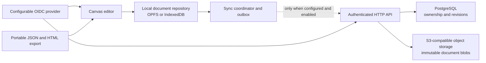

# Optional server persistence plan

Status: proposed for review

Date: 2026-09-01

## Decision summary

Add authenticated server persistence as an optional adapter around the current
local-first application. A canvas is always saved locally before it is queued
for upload. Anonymous use, offline editing, JSON import/export, and the static
GitHub Pages build continue to work without an API.

The first release is backup and multi-device persistence for one owner. It is
not multiplayer: there are no shared canvases, presence indicators, live
cursors, roles, real-time transports, or CRDTs.

Recommended implementation:

- keep `CanvasDocument` as the portable document contract
- keep OPFS with IndexedDB fallback as the immediate working store
- add local sync metadata and an outbox outside exported documents
- run a separately deployed TypeScript HTTP API
- use configurable OpenID Connect (OIDC) with Authorization Code and PKCE
- store ownership and revision metadata in PostgreSQL
- store immutable document revision blobs in S3-compatible object storage
- use opaque revisions/ETags for optimistic concurrency
- preserve both versions whenever automatic conflict resolution is unsafe

This document is an implementation plan, not a claim that server persistence
has shipped.

## Product invariants

The feature must preserve these behaviors:

1. Opening, editing, searching, importing, exporting, and deleting local
   canvases do not require an account or reachable server.
2. Cloud save is off until a user signs in and enables it for a canvas.
3. Every edit reaches the existing local repository before any remote upload.
4. A failed or slow request never blocks the editor or changes the local save
   indicator to a failure.
5. The exported JSON document contains no account, provider, token, remote ID,
   or synchronization metadata.
6. A concurrent edit is never silently replaced by last-write-wins behavior.
7. Signing out or disconnecting a canvas does not delete its local copy.
8. The same static frontend can be deployed with no server configuration.

The UI should distinguish `Saved locally`, `Syncing`, `Saved to server`,
`Offline`, and `Needs attention`. Local durability and remote synchronization
are separate states.

## Current seams

The proof of concept already has useful boundaries:

- `app/lib/model.ts` owns the versioned `CanvasDocument` and validation.
- `app/lib/persistence.ts` owns OPFS/IndexedDB save, load, list, and remove.
- `app/lib/transfer.ts` imports and exports the same document shape.
- `CanvasWorkspace` performs a debounced local autosave after document changes.
- images are currently embedded data URLs; an imported document can be up to
  50 MB and one image source can approach 45 MB.
- the production site is a static export deployed to GitHub Pages.

The remote implementation should extend these seams instead of putting fetch,
authentication, or conflict logic into the renderer or document model.

## Target topology



The browser remains the working application. The API is a persistence service,
not an editor runtime or rendering service.

## Frontend design

### Repository and sync boundaries

Introduce interfaces before adding network behavior:

```ts
interface LocalDocumentRepository {
  save(document: CanvasDocument): Promise<void>;
  load(localId: string): Promise<CanvasDocument>;
  list(): Promise<CatalogEntry[]>;
  remove(localId: string): Promise<void>;
}

interface RemoteCanvasRepository {
  create(document: CanvasDocument, idempotencyKey: string): Promise<RemoteVersion>;
  get(remoteId: string): Promise<RemoteVersionWithDocument>;
  list(cursor?: string): Promise<RemotePage>;
  update(remoteId: string, baseRevision: string, document: CanvasDocument): Promise<RemoteVersion>;
  remove(remoteId: string, baseRevision: string): Promise<void>;
}
```

The existing persistence functions can first be wrapped by the local interface
without changing behavior. A `SyncCoordinator` observes successful local saves,
calculates a deterministic content hash, and appends or coalesces an outbox job.
Only this coordinator calls the remote repository.

### Local-only synchronization metadata

Add IndexedDB stores for bindings and the retry outbox. A binding contains:

```ts
type RemoteBinding = {
  localDocumentId: string;
  remoteCanvasId: string;
  remoteRevision: string;
  syncedContentHash: string;
  syncEnabled: boolean;
  lastSyncedAt?: string;
  lastErrorCode?: string;
};
```

The outbox records the local document ID, expected remote revision, content
hash, attempt count, and next eligible attempt time. It does not need to copy
the document blob: the worker reads the latest locally saved revision when the
job runs. Multiple pending updates for one canvas are coalesced.

Bindings are intentionally excluded from `CanvasDocument`, JSON export, HTML
export, and searchable canvas text.

### Save sequence

```mermaid
sequenceDiagram
    participant E as Editor
    participant L as Local repository
    participant S as Sync coordinator
    participant A as Server API
    E->>L: Save CanvasDocument
    L-->>E: Local save complete
    E-->>E: Show Saved locally
    L->>S: Enqueue latest content hash
    S->>A: PUT with If-Match revision
    alt accepted
        A-->>S: New ETag/revision
        S-->>E: Show Saved to server
    else offline or retryable failure
        S-->>S: Keep coalesced outbox job
        S-->>E: Show Offline or Sync pending
    else stale revision
        A-->>S: 412 Precondition Failed
        S-->>E: Preserve both versions; Needs attention
    end
```

Use exponential backoff with jitter for retryable failures and retry when the
browser reports that it is online. Authentication and validation failures are
not retried indefinitely; they require user action.

### Canvas library behavior

After sign-in, merge the local catalog with the paginated remote catalog:

- a bound local canvas shows its server status
- a remote-only entry is a lightweight stub until opened
- opening a remote-only entry downloads, validates, and saves a local copy
- `Save to server` creates a binding for the current local canvas
- `Stop saving to server` removes the binding but keeps both copies
- `Delete local copy` does not implicitly delete the remote copy
- `Delete everywhere` is a separate confirmed action

A user should be able to create and edit while signed out, then opt one or more
existing canvases into server persistence later.

### Conflict behavior

Multiple devices can conflict even without multiplayer. Every update must send
the last observed opaque revision using `If-Match`. The API returns `412
Precondition Failed` when the revision is stale.

For the first release, do not attempt field-level merging. Preserve the unsynced
local canvas, download the current remote canvas as a new local conflict copy,
pause synchronization for the binding, and offer explicit actions:

- keep the local version and replace the server version
- replace the local version with the server version
- keep both as independent canvases

Replacing either side requires confirmation. The server replacement retries
against the freshly fetched revision, not an unconditional write.

### Authentication and configuration

Use an OIDC provider through Authorization Code with PKCE. The API identifies a
user by the stable `(issuer, subject)` pair in a validated access token; email is
display metadata and must not be the ownership key. Do not implement passwords
in opengorky.

The static frontend reads an optional runtime configuration file such as
`opengorky-config.json` containing public values only:

```json
{
  "apiBaseUrl": "https://api.opengorky.example",
  "oidcIssuer": "https://identity.example",
  "oidcClientId": "opengorky-web",
  "oidcAudience": "opengorky-api"
}
```

If the file is absent or invalid, account and server-save controls remain
hidden and the local app behaves exactly as it does now. Access tokens should
be short-lived and kept in memory. A provider session may reauthenticate after
refresh; persistent browser storage must not contain bearer or refresh tokens.
The exact provider and session UX require an ADR before implementation.

## API contract

All `/v1` routes require a valid access token. Ownership checks are applied to
every canvas lookup; unknown and unauthorized IDs return the same response.

| Method | Route | Purpose |
| --- | --- | --- |
| `GET` | `/v1/me` | Return the authenticated user's display profile and limits |
| `GET` | `/v1/canvases?cursor=` | Return paginated owned canvas metadata |
| `POST` | `/v1/canvases` | Create a server copy from a validated document |
| `GET` | `/v1/canvases/{id}` | Return metadata and the current validated document |
| `PUT` | `/v1/canvases/{id}` | Replace the current document when `If-Match` succeeds |
| `DELETE` | `/v1/canvases/{id}` | Soft-delete when `If-Match` succeeds |

Create and update requests include an `Idempotency-Key`. Successful reads and
writes return an opaque strong `ETag`; clients must not infer revision ordering
from its contents. Create returns `201`, update returns `200`, delete returns
`204`, a stale precondition returns `412`, and a payload beyond the configured
limit returns `413`.

The API validates the same schema and invariants as import before committing a
revision. Shared JSON Schema or a framework-neutral validation package should
become the cross-process contract; importing browser code into the API would
break the existing dependency rule.

## Server storage model

Recommended metadata tables:

```text
users
  id, oidc_issuer, oidc_subject, display_name, created_at, last_seen_at

canvases
  id, owner_id, title, current_revision_id, created_at, updated_at, deleted_at

canvas_revisions
  id, canvas_id, revision_number, document_object_key, content_sha256,
  content_bytes, schema_version, created_at
```

`(oidc_issuer, oidc_subject)` is unique. Canvas and revision IDs are
server-generated. A transaction locks the canvas row, verifies the expected
revision, inserts the immutable revision metadata, and advances the current
pointer. Document blobs are encrypted in transit and at rest through the
storage platform.

Because current documents can contain large base64 images, store the serialized
document blob in object storage rather than PostgreSQL JSONB. A later format
version may externalize deduplicated assets, but that is not a prerequisite for
the first compatible implementation. Start with parity with the existing 50 MB
import ceiling and make the hosted limit visible through `/v1/me`; revisit the
limit with measured storage and validation costs.

Revision retention and deletion retention are policy decisions. Until they are
set, the implementation must not promise recoverability or immediate physical
erasure.

## Backend deployment options

| Option | Advantages | Costs and risks | Decision |
| --- | --- | --- | --- |
| Separate TypeScript API, PostgreSQL, S3-compatible storage | Portable, explicit ownership/concurrency, matches the frontend language, keeps GitHub Pages static | More infrastructure and operations | **Recommended** |
| Backend-as-a-service | Fast identity/database setup and less initial operations | Couples policies, auth, and storage to one platform; large document blobs still need care | Useful for a disposable spike only |
| Serverless document/KV store | Simple deployment and elastic request handling | Provider-specific limits, weaker relational ownership/revision queries, migration cost | Do not choose without a measured reason |
| Add API routes to the current web build | One source tree and development command | Incompatible with the current static export and makes local-only hosting less clear | Not recommended |

Keep the API in this repository initially under a separate application boundary
(for example, `apps/api`) only after the current proof of concept has been split
into shared packages. It must deploy independently from `apps/web`.

## Security and privacy requirements

- validate token issuer, audience, signature, expiry, and subject
- authorize by server-side owner ID on every read and mutation
- allow CORS only from configured application origins
- apply request, object-count, connector-count, string, and image-size limits
- validate content type and document schema before storing a revision
- rate-limit account, list, read, and write routes independently
- never log canvas titles, text, URLs, images, documents, or access tokens
- log request IDs, authenticated internal user ID, operation, result, size, and
  latency for audit and diagnosis
- encrypt network traffic and use managed encryption for database, objects, and
  backups
- test backup restoration, not only backup creation
- isolate object keys from user-supplied file names and document IDs
- scan dependencies and container images in CI
- update the privacy page before enabling the hosted feature, including data
  categories, purpose, subprocessors, retention, deletion, export, and contact
  details

End-to-end encryption is not part of the first release. It would improve server
confidentiality but changes validation, previews, recovery, search, and key-loss
semantics enough to require a separate product and threat-model decision.

## Observability

Track service health without collecting canvas contents:

- create/update/read/delete success and error rates
- authentication failures and authorization denials
- upload/download size and latency distributions
- `412` conflict count and resolution outcomes
- queued sync age and retry count reported as aggregate client telemetry only
  if telemetry is separately disclosed and enabled
- orphaned blob cleanup and revision/database consistency checks
- backup age and restore-test results

Do not add product analytics as an implicit side effect of server persistence.

## Delivery sequence

### Phase 0: decisions and contracts

- approve this architecture and write ADRs for OIDC provider/session behavior,
  API framework, deployment platform, retention, and backend repository layout
- extract deterministic serialization and validation into a browser/server-safe
  package
- define API schemas, errors, ETags, idempotency, and service limits
- add a threat model and privacy review

### Phase 1: frontend seams with a fake remote

- wrap current persistence behind `LocalDocumentRepository`
- implement sync bindings, durable outbox, and state machine
- test against an in-memory `RemoteCanvasRepository`
- add disabled-by-default runtime configuration and status UI
- prove local behavior is unchanged when configuration or network is absent

### Phase 2: persistence service

- implement OIDC token validation and owner isolation
- add PostgreSQL migrations and immutable object-backed revisions
- implement the `/v1` contract, limits, idempotency, and optimistic concurrency
- add integration tests with real PostgreSQL and S3-compatible storage

### Phase 3: opt-in product flow

- add sign-in/sign-out and `Save to server`
- merge remote stubs into the file library and support lazy download
- implement offline retry, conflict preservation, unlink, and explicit deletion
- revise privacy language and operator documentation

### Phase 4: production hardening

- load, abuse, cross-origin, token-expiry, and restore testing
- staged rollout behind runtime configuration
- monitor error, latency, conflict, storage, and cost budgets
- document self-hosting and data export/deletion operations

## Verification matrix

Automated tests must cover:

- local create/edit/autosave/list/delete with server configuration absent
- local save succeeding while every remote request fails
- first upload, idempotent retry, update, download, and paginated listing
- restart while an outbox item is pending
- coalescing multiple edits into the latest safe upload
- expired/invalid tokens and sign-out with local copies retained
- owner A unable to enumerate, read, update, or delete owner B's canvas
- malformed, oversized, duplicate-ID, and unsupported-version documents
- `If-Match` success and stale-revision conflict preservation
- unlink, local-only deletion, remote soft deletion, and retention behavior
- JSON import/export remaining free of remote metadata
- embedded images at practical and maximum supported payload sizes
- CORS allowlist and logs containing no document content or credentials
- static Pages build and offline editing with no API
- database/object consistency and tested backup restoration

Browser acceptance tests should exercise a real two-device conflict, offline
edit/reconnect, reload during a pending upload, token expiration, and explicit
delete/unlink choices. Unit tests alone do not prove those user-visible flows.

## Release acceptance criteria

Server persistence is ready for an opt-in preview only when:

- the unconfigured static build passes the existing local persistence and
  import/export suite unchanged
- a user must explicitly sign in and enable server save
- local save completes before upload is scheduled
- server/network/auth failures do not prevent continued local editing
- stale revisions preserve both documents and require an explicit resolution
- an authenticated user can only access their own canvases
- logout, unlink, local delete, and remote delete have distinct tested outcomes
- portable exports contain no provider-specific state
- privacy, retention, deletion, backup, and operator documentation match the
  deployed service
- the hosted API has alerts, rate limits, backups, and a successful restore test

## Decisions required before implementation

1. Which OIDC provider will the hosted service use, and should self-hosters be
   able to configure any compliant provider in the first release?
2. Will a custom application/API domain permit a same-site backend session, or
   should the static client use short-lived bearer tokens only?
3. Is server autosync enabled automatically after a canvas's first explicit
   upload, or does every remote save remain manual?
4. How long are deleted canvases and historical revisions retained?
5. Does the initial hosted service accept the full 50 MB local format limit?
6. Will the API live in this monorepo or in a separately operated repository?
7. Is end-to-end encryption a future goal or explicitly outside the product
   direction?

## Explicit non-goals

- multiplayer editing, presence, live cursors, comments, or WebSockets
- sharing, public links, teams, roles, or organization administration
- CRDT/operational-transform synchronization
- mandatory accounts or server-only canvases
- server-side rendering or server-side canvas export
- server search over canvas contents in the first release
- provider-specific fields in the portable document
